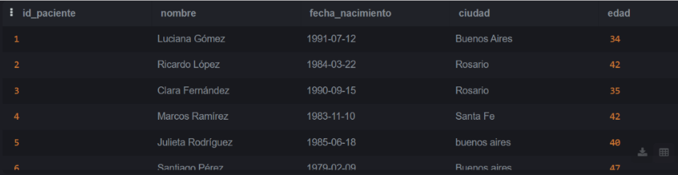
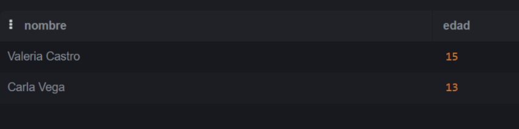
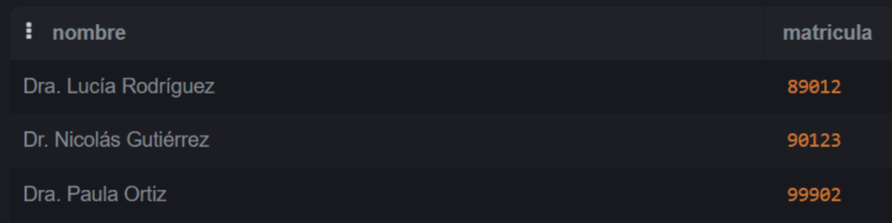
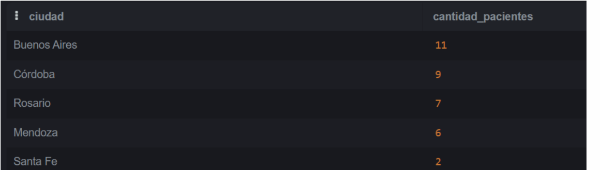
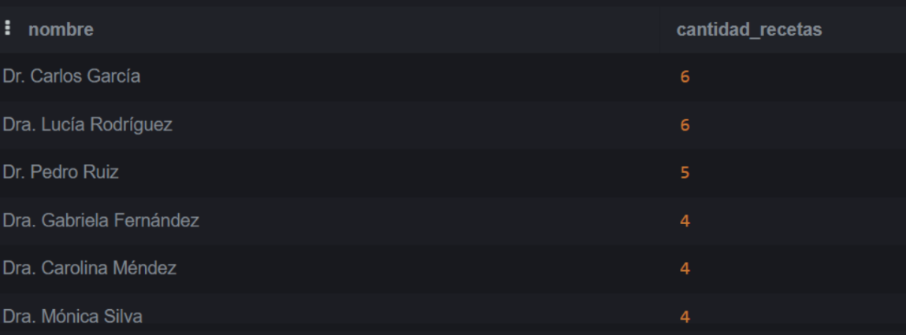
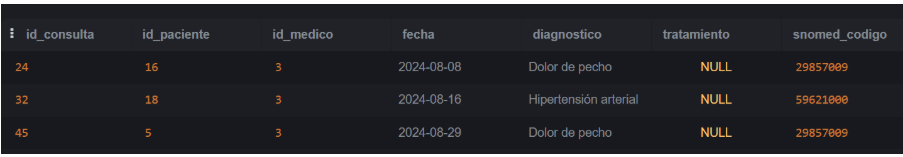

# TP_BIOINFO-MEDICA
### INTEGRANTES
- Milagro Alessandra Rodriguez Camarena
- Thiago Sayegh
- Martin Leonardo Porjolovsky
<br>


#### Nombre de la materia: Informática Médica
#### Nombre de profesor: Berrino Eugenia y Piacentino Melina

## Parte 2: Base de datos
### Query 1:
[01_InfoMed_TP5_Rodriguez_Porjolovsky_Sayegh.sql](./01_InfoMed_TP5_Rodriguez_Porjolovsky_Sayegh.sql)

```sql
CREATE INDEX idx_pacientes_ciudad ON Pacientes(ciudad)
```

### Query 2:
[02_InfoMed_TP5_Rodriguez_Porjolovsky_Sayegh.sql](./02_InfoMed_TP5_Rodriguez_Porjolovsky_Sayegh.sql)

```sql
CREATE VIEW VistasPacientes AS
SELECT
    id_paciente,
    nombre,
    fecha_nacimiento,
    ciudad,
    (strftime('%Y', 'now') - strftime('%Y', fecha_nacimiento)
    - CASE
        WHEN strftime('%m-%d', 'now') < strftime('%m-%d', fecha_nacimiento)
        THEN 1
        ELSE 0
      END) AS edad
FROM Pacientes;
```
<br>


### Query 3:
[03_InfoMed_TP5_Rodriguez_Porjolovsky_Sayegh.sql](./03_InfoMed_TP5_Rodriguez_Porjolovsky_Sayegh.sql)

```sql
SELECT nombre, edad
FROM VistasPacientes
WHERE edad < 18;

```
<br>

### Query 4:

[04_InfoMed_TP5_Rodriguez_Porjolovsky_Sayegh.sql](./04_InfoMed_TP5_Rodriguez_Porjolovsky_Sayegh.sql)


```sql
UPDATE Pacientes
SET calle = 'Calle Corrientes',
    numero = '500',
    ciudad = 'Buenos Aires'
WHERE nombre = 'Luciana Gómez';

```
<br>

### Query 5:

[05_InfoMed_TP5_Rodriguez_Porjolovsky_Sayegh.sql](./05_InfoMed_TP5_Rodriguez_Porjolovsky_Sayegh.sql)

```sql
SELECT nombre, matricula
FROM Medicos
WHERE especialidad_id = 4;

```
<br>

### Query 6:

[06_InfoMed_TP5_Rodriguez_Porjolovsky_Sayegh.sql](./06_InfoMed_TP5_Rodriguez_Porjolovsky_Sayegh.sql)

```sql
SELECT nombre, calle, numero, ciudad
FROM Pacientes
WHERE ciudad = 'Buenos Aires';

```
<br>


### Query 7:
[07_InfoMed_TP5_Rodriguez_Porjolovsky_Sayegh.sql](./07_InfoMed_TP5_Rodriguez_Porjolovsky_Sayegh.sql)

```sql
UPDATE Pacientes SET ciudad = 'Buenos Aires' WHERE LOWER(TRIM(ciudad)) LIKE '%buenos%aire%';
UPDATE Pacientes SET ciudad = 'Buenos Aires' WHERE ciudad = 'Buenos Aiers';
UPDATE Pacientes SET ciudad = 'Córdoba' WHERE LOWER(TRIM(ciudad)) LIKE '%c_rdoba%' OR LOWER(TRIM(ciudad)) LIKE '%cordoba%';
UPDATE Pacientes SET ciudad = 'Córdoba' WHERE ciudad = 'Córodba';
UPDATE Pacientes SET ciudad = 'Mendoza' WHERE LOWER(TRIM(ciudad)) LIKE '%mendoza%' OR LOWER(TRIM(ciudad)) LIKE '%mendzoa%';
UPDATE Pacientes SET ciudad = 'Rosario' WHERE LOWER(TRIM(ciudad)) = 'rosario';


```

### Query 8:
[08_InfoMed_TP5_Rodriguez_Porjolovsky_Sayegh.sql](./08_InfoMed_TP5_Rodriguez_Porjolovsky_Sayegh.sql)
```sql
SELECT ciudad, COUNT(*) AS cantidad_pacientes
FROM Pacientes
GROUP BY ciudad
ORDER BY cantidad_pacientes DESC;

```
<br>


### Query 9:
[09_InfoMed_TP5_Rodriguez_Porjolovsky_Sayegh.sql](./09_InfoMed_TP5_Rodriguez_Porjolovsky_Sayegh.sql)
```sql

SELECT p.ciudad, s.descripcion AS sexo, COUNT(*) AS cantidad_pacientes
FROM Pacientes p
JOIN SexoBiologico s ON p.id_sexo = s.id_sexo
GROUP BY p.ciudad, s.descripcion
ORDER BY p.ciudad, s.descripcion;

```
<br>




### Query 11:
[11_InfoMed_TP5_Rodriguez_Porjolovsky_Sayegh.sql](./QUERY/11_InfoMed_TP5_Rodriguez_Porjolovsky_Sayegh.sql)
```sql
SELECT *
FROM Consultas
WHERE id_medico = 3
AND strftime('%Y-%m', fecha) = '2024-08';
```
<br>


### Query 12:
[12_InfoMed_TP5_Rodriguez_Porjolovsky_Sayegh.sql](./QUERY/12_InfoMed_TP5_Rodriguez_Porjolovsky_Sayegh.sql)
```sql
SELECT p.nombre, c.fecha, c.diagnostico
FROM Consultas c
JOIN Pacientes p ON c.id_paciente = p.id_paciente
WHERE strftime('%Y-%m', c.fecha) = '2024-08';

```
<br>


### Query 13:
[13_InfoMed_TP5_Rodriguez_Porjolovsky_Sayegh.sql](./QUERY/13_InfoMed_TP5_Rodriguez_Porjolovsky_Sayegh.sql)
```sql
SELECT m.nombre, COUNT(*) AS veces_recetado
FROM Recetas r
JOIN Medicamentos m ON r.id_medicamento = m.id_medicamento
WHERE r.id_medico = 2
GROUP BY r.id_medicamento, m.nombre
HAVING COUNT(*) > 1;


```
<br>


